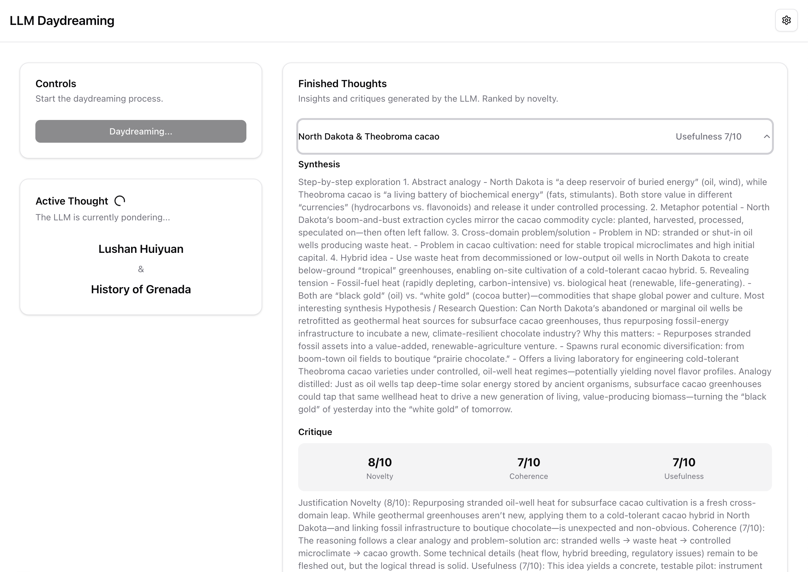

## Toy LLM Daydreaming 

Inspired by https://gwern.net/ai-daydreaming, let's you try a few daydream loops using OpenAI models.


## Install

First, run the development server:

```bash
npm run dev
# or
yarn dev
# or
pnpm dev
# or
bun dev
```

Enter an OpenAI key to use it.

## What it does

The Vital article titles are pulled from wikipedia, they are already in the `scraper` folder. 

Randomly pull two of them and run gwern's prompts on it: 

[SYSTEM]
You are a creative synthesizer. Your task is to find deep, non-obvious,
and potentially groundbreaking connections between the two following concepts.
Do not state the obvious. Generate a hypothesis, a novel analogy,
a potential research question, or a creative synthesis.
Be speculative but ground your reasoning.
 
Concept 1: {Chunk A}
Concept 2: {Chunk B}
 
Think step-by-step to explore potential connections:
 
#. Are these concepts analogous in some abstract way?
#. Could one concept be a metaphor for the other?
#. Do they represent a similar problem or solution in different domains?
#. Could they be combined to create a new idea or solve a problem?
#. What revealing contradiction or tension exists between them?
 
Synthesize your most interesting finding below.
[ASSISTANT]
 
...
 
[SYSTEM]
You are a discerning critic. Evaluate the following hypothesis
on a scale of 1--10 for each of the following criteria:
 
- **Novelty:** Is this idea surprising and non-obvious? (1=obvious, 10=paradigm-shifting)
- **Coherence:** Is the reasoning logical and well-formed? (1=nonsense, 10=rigorous)
- **Usefulness:** Could this idea lead to a testable hypothesis, a new product,
  or a solution to a problem? (1=useless, 10=highly applicable)
 
Hypothesis: {Synthesizer Output}
 
Provide your scores and a brief justification.
[ASSISTANT]


